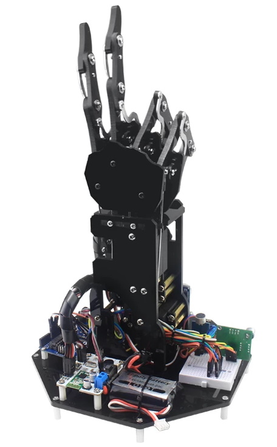

# robotic-hand

Assembly and operating notes for an 5DOF servo-controlled robotic hand, controlled via a Bluetooth glove controller.

I've seen several similar "robotic hand" devices sold via Banggood, AliExpress etc.
Some of them are litte more than a basic articulated frame in which five servo motors can be housed, like this one available from https://www.banggood.com/custlink/mKKhNqydNO . Note that it contains no control mechanism at all.


Other designs incorporate interfaces for bluetooth, PS2 controller, or other inputs, and the most feature-rich versions I've encountered seem to be described as either "uHand", "uHand v2.0", or "leHand", and marketed by "Lobot", "LowanSoul" or "HiWonder" : 

This comes in several flavours: Raspberry Pi, Arduino, micro:bit, or STM32 controllers. 

There is also a glove controller that sometimes comes bundled with it:


The glove controller comes with an HC-08 BLE 4.0 module. By default, this is configured to run in master mode (i.e. it connects to *other* Bluetooth devices), whereas I found it more convenient to operate as a slave device. So, first I uploaded some code to be able to pass AT commands from the serial monitor through to the BlueTooth module:

```
#include <SoftwareSerial.h>

SoftwareSerial mySerial(11, 12); // RX, TX

void setup() {
  Serial.begin(9600);
  Serial.println("Enter AT commands:");
  mySerial.begin(9600);
}

void loop() {
  if (mySerial.available())
    Serial.write(mySerial.read());

  if (Serial.available())
    mySerial.write(Serial.read());
}
```
Having done that, I could retrieve information about the glove (remember to set "No line ending" in the serial monitor) by issuing the command:
```
AT
OK
```
Find the connection information:
```
AT+RX
Name:
Role:Master
Baud:9600,NONE
Addr:F8,33,31,A4,0C,EC
PIN :000000
www.hc01.com
www.hc01.com
www.hc01.com
```
Change to slave mode:
```
AT+ROLE=S
OK
```
If desired, change the name of the interface
```
AT+NAME=Glove
OKsetNAME:Glove
```


