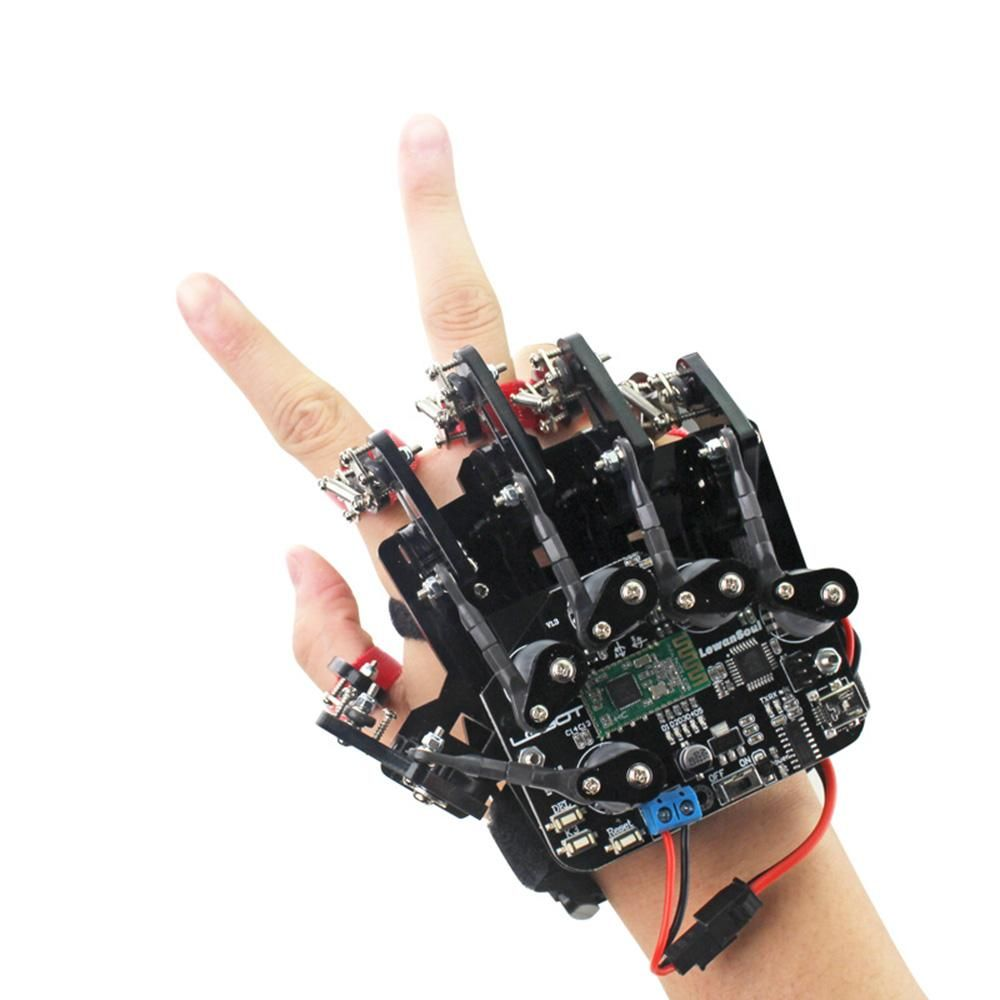

# robotic-hand

Assembly and operating notes for an 5DOF servo-controlled robotic hand, controlled via a Bluetooth glove controller.

I've seen several similar "robotic hand" devices sold via Banggood, AliExpress etc.
 - Some of them are litte more than a lasercut articulated frame in which five servo motors can be housed, like this one available from https://www.banggood.com/custlink/mKKhNqydNO . Note that it contains no control mechanism at all.
 - Other designs incorporate interfaces for bluetooth, PS2 controller, or other inputs, controlled by Raspberry Pi, micro:bit, or STM32. I've encountered versions described as "uHand", "uHand v2.0", or "leHand", and marketed by "Lobot", "LowanSoul" or "HiWonder".
  - There is also a glove controller that sometimes comes bundled with these hands, which has an ATMega328 chip and HC-08 BLE 4.0 module.
 

These are all advertised as being "open source", but finding information about the software or hardware they use is difficult, to say the least! So I created this repository to gather and open-source my experiences with them.
