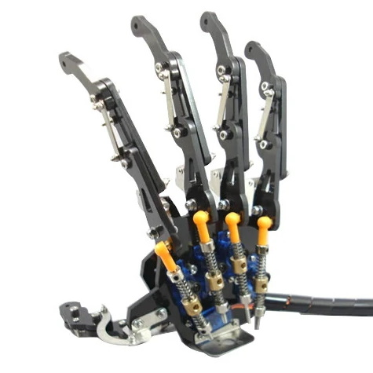

# robotic-hand
5DOF Robot Hand

Assembly and operating notes for an Arduino 5DOF servo-controlled robotic hand, as available from https://www.banggood.com/custlink/mKKhNqydNO



The glove controller comes with an HC-08 BLE 4.0 module. By default, this is configured to run in master mode (i.e. it connects to *other* Bluetooth devices), whereas I found it more convenient to operate as a slave device. So, first I uploaded some code to be able to pass AT commands from the serial monitor through to the BlueTooth module:

```
#include <SoftwareSerial.h>

SoftwareSerial mySerial(11, 12); // RX, TX

void setup() {
  Serial.begin(9600);
  Serial.println("Enter AT commands:");
  mySerial.begin(9600);
}

void loop() {
  if (mySerial.available())
    Serial.write(mySerial.read());

  if (Serial.available())
    mySerial.write(Serial.read());
}
```
Having done that, I could retrieve information about the glove (remember to set "No line ending" in the serial monitor) by issuing the command:
```
AT
OK
```
Find the connection information:
```
AT+RX
Name:
Role:Master
Baud:9600,NONE
Addr:F8,33,31,A4,0C,EC
PIN :000000
www.hc01.com
www.hc01.com
www.hc01.com
```
Change to slave mode:
```
AT+ROLE=S
OK
```
If desired, change the name of the interface
```
AT+NAME=Glove
OKsetNAME:Glove
```


